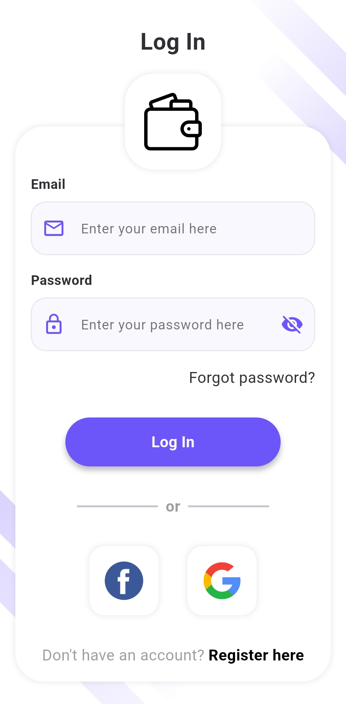
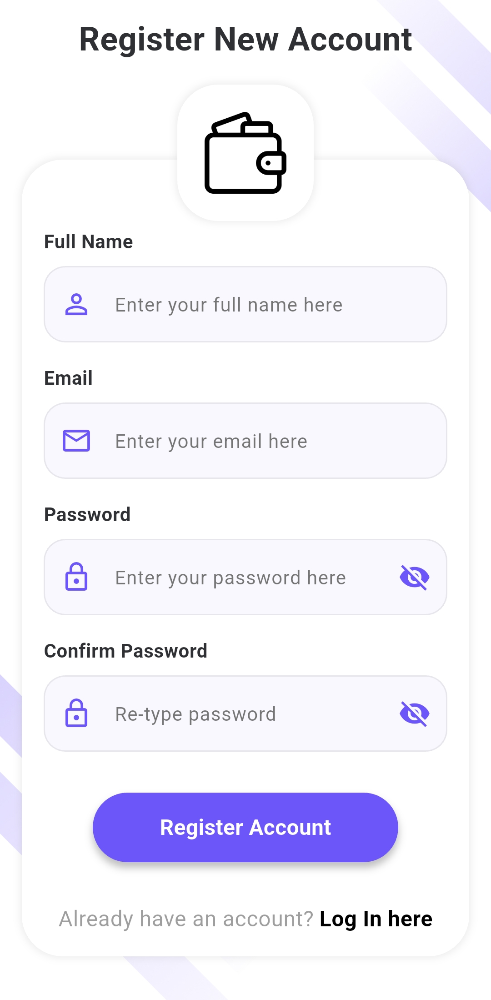
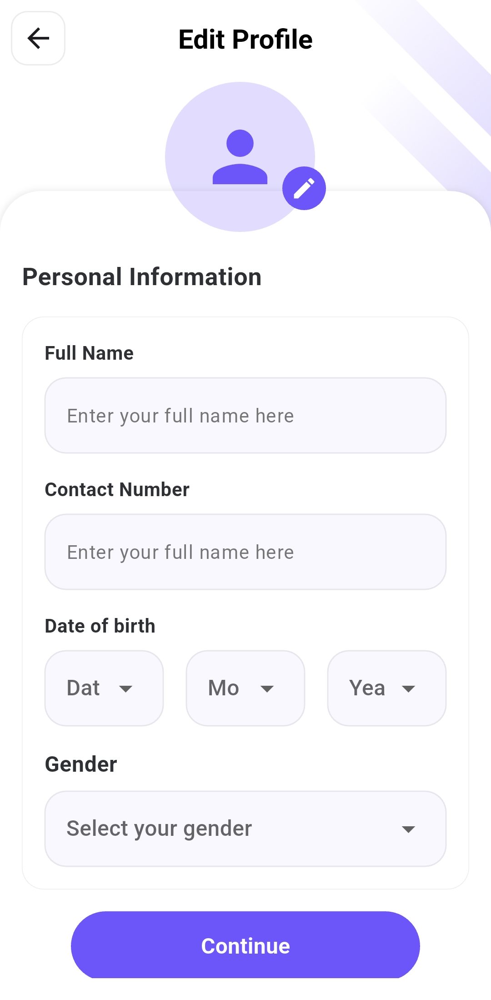
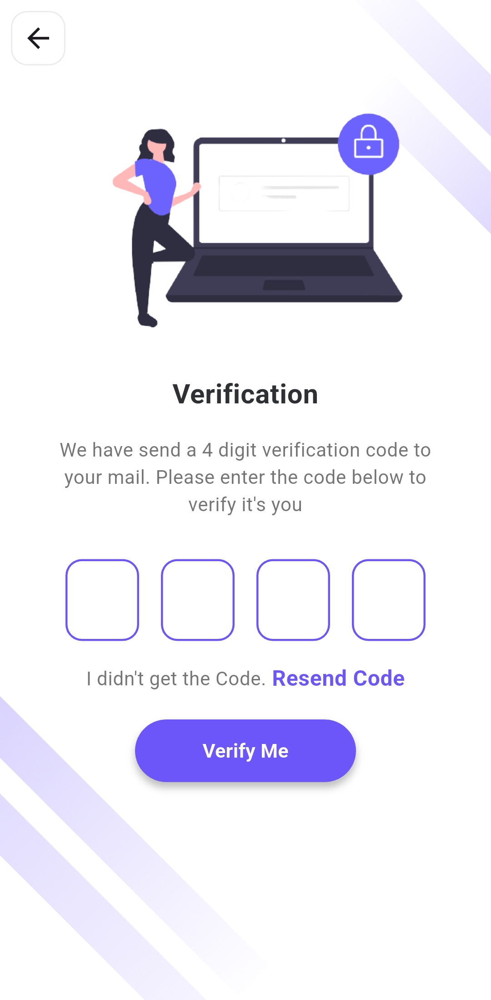
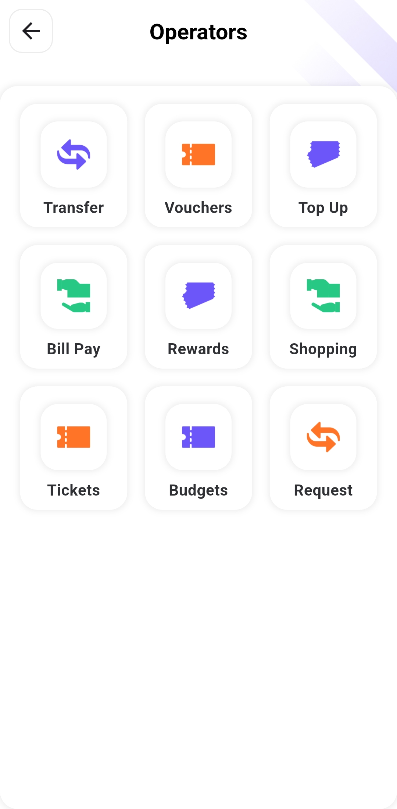
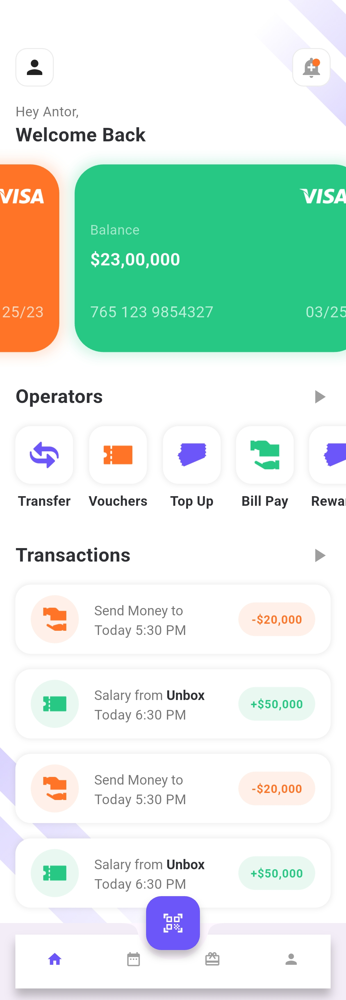
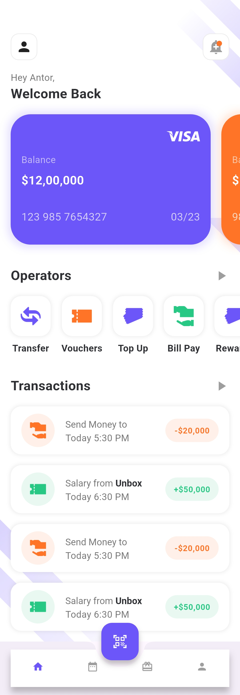
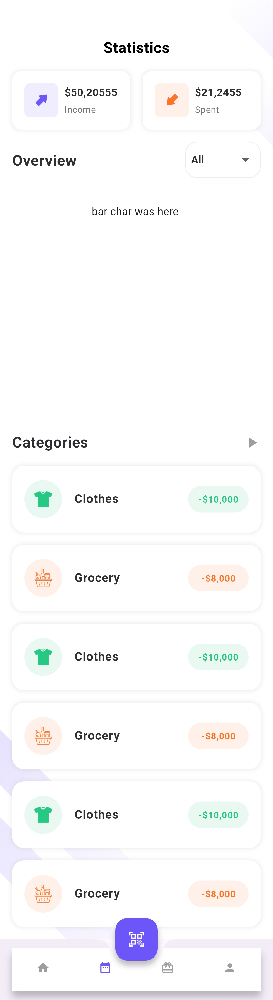

# Wallet Flutter – UI Demo

A Flutter demo app for a modern wallet or payment solution UI.  
This is a **UI-only** project, with no backend or actual payment integration.

---

## 📱 Overview

The app includes design components suitable for:

- Wallets and transaction management
- Balance display and recent activity
- Transfer and payment features

---

## 🔍 Status

**Demo only** – UI-focused, no backend or payment logic implemented.

---

## 📸 Screenshots

<table>
  <tr>
    <td></td>
    <td></td>
    <td></td>
    <td></td>
  </tr>
  <tr>
    <td></td>
    <td></td>
    <td></td>
    <td></td>
  </tr>
  <tr>
    <td></td>
    <td></td>
    <td></td>
    <td></td>
  </tr>
</table>

---

## 📝 Notes

- Built entirely with Flutter
- Clean, modular UI components
- Great starting point for wallet, finance, or banking apps

---

## ✍️ Created by

**Mohamed Ebrahim**
